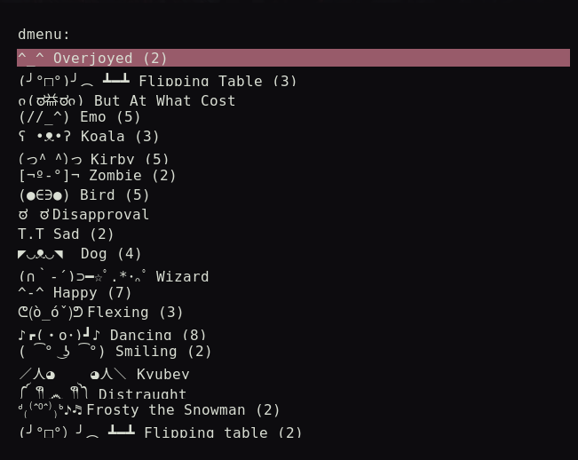

# Dmenu Kaomoji

kaomoji picker for dmenu



## Install

```
git clone https://github.com/eylles/dmenukaomoji
cd dmenukaomoji
make install
```

## How To Use

run the script and pick a kaomoji, then paste it, you can run the script from dmenu itself, it will work with dmenu replacements like rofi.
